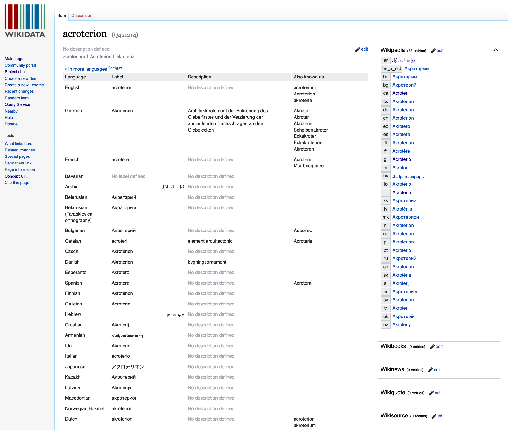
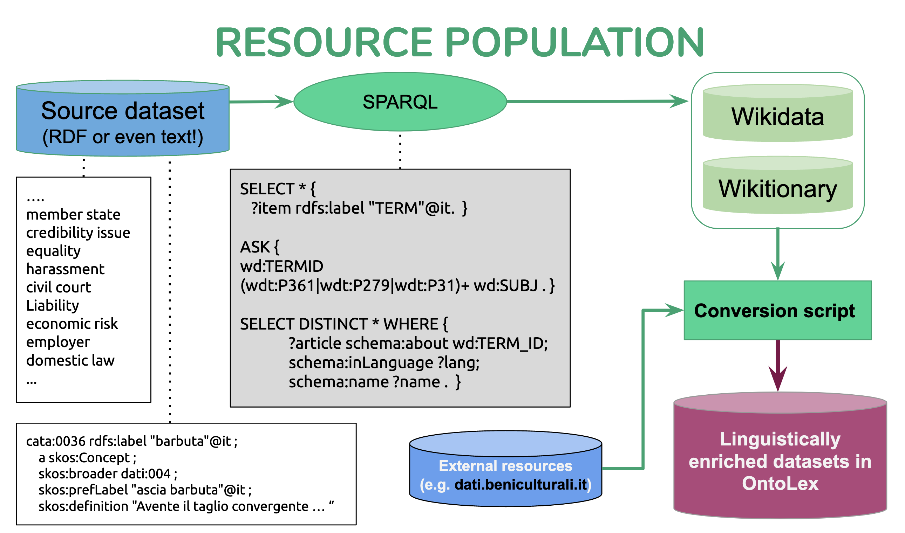

# Resource enrichment using Wikidata and Wiktionary 

There are an increasing number of lexical resources available online which are machine-friendly and can be accessed by linked data techniques.

In this repository, we provide a program which collects linguistic information for a given word, in raw text or triples, and converts the collected data to Lemon-OntoLex ontology. The current resources being used are [Wikidata](https://www.wikidata.org/wiki/Wikidata:Main_Page) and [Wiktionary](https://www.wiktionary.org/). However, any resource which can be accessed via a SPARQL endpoint can be used in this program. 

The following image shows information for the Italian word "acroterio" in Wikidata. 



## How does it work?

Given a list of words in text or in RDF, this program collects all the relevant information in Wikidata and Wiktionary. 



### Change categories

In order to collect data in a specific domain, you can add your desired category to the `subjects`. Note that this may affect the performance of the queries as it will take longer to check all the domains. 

```
 subjects = {"architecture":"Q12271", "archeology": "Q10855079", "law" : "Q7748", "legal science" : "Q382995", "social issue" : "Q1920219", "jurisprudence" : "Q4932206", "rule" : "Q1151067", "Economy" : "Q159810", "Economics" : "Q8134", "labour law" : "Q628967", "human action" : "Q451967", "legal concept" : "Q2135465"}
```

### Include external ontologies

If you would like to link your Lemon-Ontolex data to an external ontology, you can use the `ontolex:reference` property. One of the example given datasets provide the URIs in a tab-separated format.

### Conversion to Lemon-OntoLex

The conversion is done using predefined templates for each part of each part of the data, such as, entry description, [vatrans](https://www.w3.org/2016/05/ontolex/#variation-translation-vartrans), linguistic information (pos, gender etc.). The following figure illustrated the Lemon-OntoLex core model. 


## Limitations

Please note that the current version of the program only takes into account very specific information and is not creating a fine-grained Lemon-Ontolex representation. For instance, only "OntoLex:LexicalEntry" for representing entries are used (no `components`). 

## Requirements
  * Python 3
  * [Wiktionary Parser](https://pypi.org/project/wiktionaryparser/)


## License

MIT License

